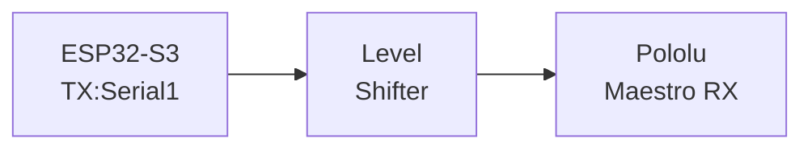
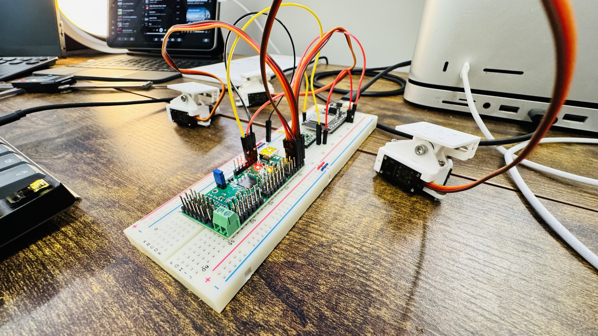

# Maestro Servo Controller

ESP32-S3 based servo controller using Pololu's Maestro board. Control up to 24 servos with adjustable speed and acceleration.

## Hardware Setup

### Power Configuration
- LOW rail (3.3V): Provided by ESP32-S3
- HIGH rail (5V): Using VUSB
- Maestro Configuration: VSRV-VIN bridge in place to use VUSB (suitable for 2-3 servos)

### Demo

## Features
- Control servos between 70-110 degrees
- Demo mode ('d' key) with three patterns:
  - Random positions
  - Synchronized sweep
  - Wave pattern
- Configurable speed and acceleration
- Serial monitoring (9600 baud)

## Quick Start
1. Configure Maestro Control Center:
   - UART mode, fixed 9600 baud
   - CRC disabled
2. Connect ESP32-S3 GPIO17 to Maestro RX (via level shifter)
3. Power up and enter:
   - 'd' for demo mode
   - 70-110 for specific angle 